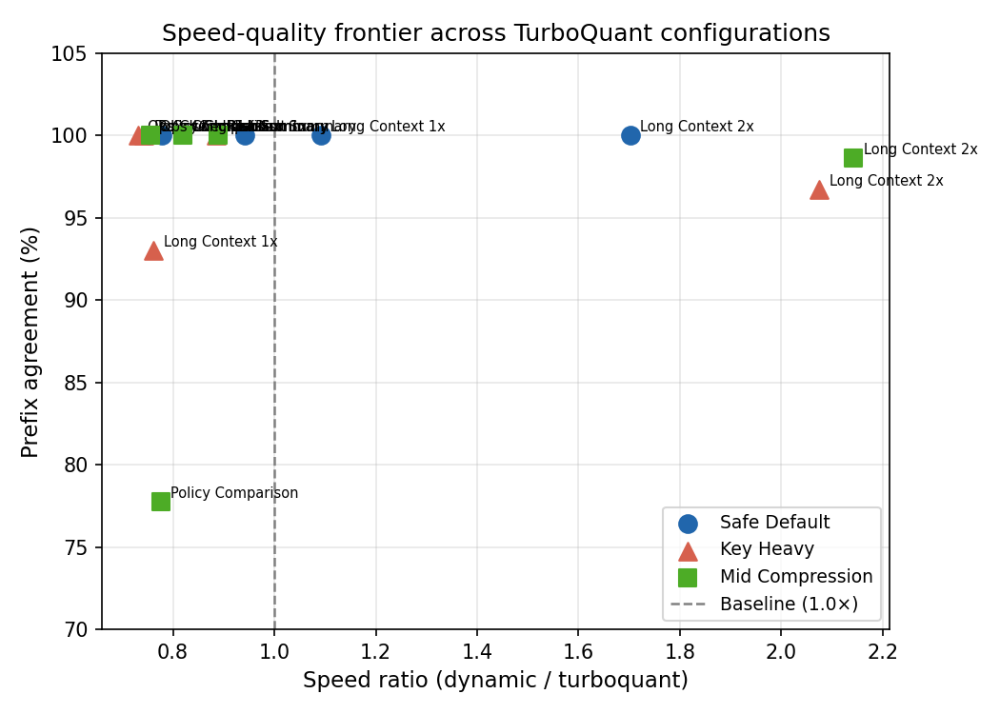
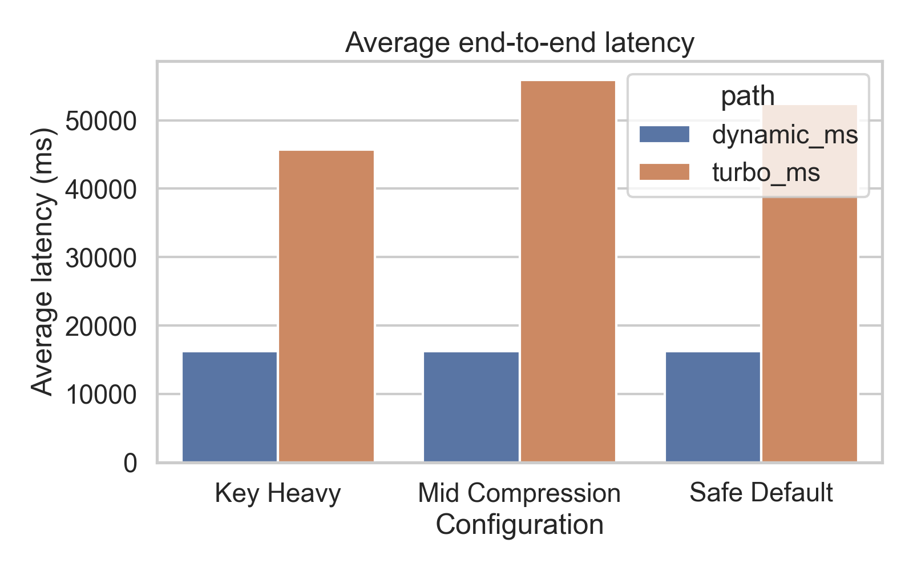
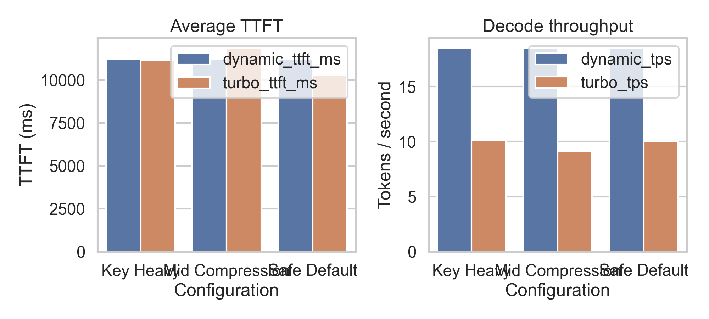
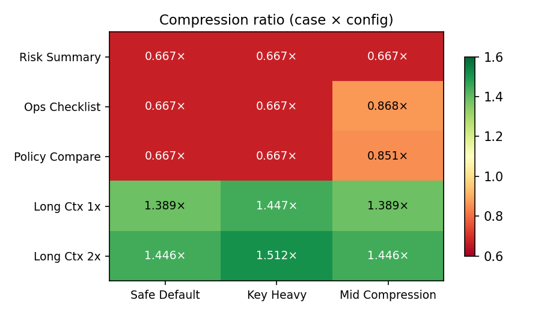
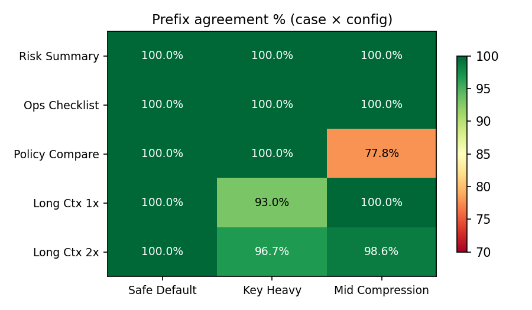
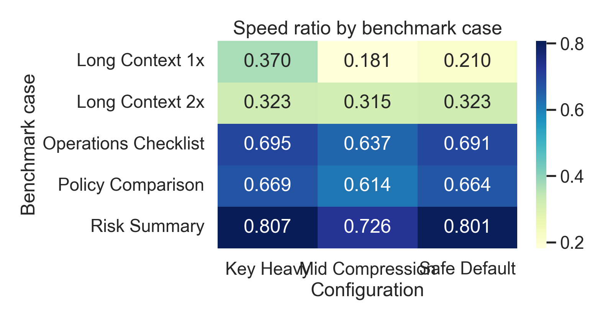

# TurboQuant in the Browser: A Feasibility Study of KV-Cache Compression for Gemma 4 on Chrome WebGPU

**Dhonam Pemba**
Stratos Lab — dhonam@stratoslab.xyz

**Kwang Wei Sim**
Stratos Lab — kwang@stratoslab.xyz

---

## Abstract

KV-cache growth is a central bottleneck for long-context autoregressive inference, and the challenge intensifies in browser environments where GPU memory budgets, CPU-to-GPU transfer overhead, and runtime abstraction costs impose additional constraints. TurboQuant has been proposed as a training-free low-bit vector quantization method capable of compressing LLM KV caches to approximately 3 bits on H100-class hardware. This paper investigates whether a TurboQuant-inspired compression strategy can operate usefully within a browser inference stack built on `transformers.js` and Chrome WebGPU.

We implement an experimental `TurboQuantCache` in a fork of `transformers.js`, exposing it through the standard generation API, and benchmark it against a dense baseline on `onnx-community/gemma-4-E2B-it-ONNX` across five prompt categories and three quantizer configurations. The updated Chrome WebGPU sweep shows a context-length crossover rather than a uniform slowdown. TurboQuant remains slower on all three short prompts, but it becomes faster on `Long Context 2x` for all tested configurations and slightly faster on `Long Context 1x` under `Safe Default`. Compression is likewise context-dependent: short prompts can expand the cache (`0.667x` to `0.868x`), while the long-context cases reach `1.389x` to `1.512x` compression. Quality is materially stronger than in the earlier run, with `Safe Default` matching the dense baseline on all five cases and the other two settings matching on three of five cases.

The central systems finding is that a cache-wrapper-only implementation — in which compressed KV state must be fully rematerialized into dense tensors before each ONNX decoder call — is not sufficient to achieve a latency benefit in this stack. The paper contributes a working `transformers.js` fork with a pluggable cache abstraction, a deterministic browser benchmark harness for Gemma 4 on Chrome WebGPU, and a quantitative characterisation of how rematerialization overhead scales with cache size.

**Keywords:** browser inference, WebGPU, `transformers.js`, KV cache, quantization, TurboQuant, Gemma 4, ONNX Runtime Web, LLM systems

---

## 1. Introduction

Browser-hosted LLM inference has become a viable deployment target. The combination of `transformers.js`, ONNX Runtime Web, and the WebGPU API now allows medium-scale generative models to run directly in Chrome-class environments without server infrastructure, trading centralized deployment cost for lower latency for the end user, stronger privacy guarantees, and offline capability. However, the resource budget for browser inference remains fundamentally tighter than for datacenter deployments. GPU memory, bandwidth, and compute are all more constrained, and the software stack introduces API boundaries and data-movement costs that do not exist in native accelerator deployments.

One of the most acute pressure points is the autoregressive KV cache. In long-context decoding, the KV cache grows with every generated token, consuming an increasing fraction of available GPU memory and imposing mounting per-step costs for cache reading, writing, and management. For browser inference, this problem is compounded: the ONNX Runtime Web execution model defaults to CPU-resident tensors, and keeping the cache GPU-resident across decode steps requires explicit IO binding. Without it, each decode step may incur a full CPU-GPU round trip for the KV state.

TurboQuant [1, 2] has been presented as a training-free solution to KV-cache pressure. Its public description is attractive: compress KV caches to roughly 3 bits using a two-stage PolarQuant + residual-correction design, preserve model quality, and achieve large speedups on accelerator-native attention kernels. These results, however, are reported for an implementation environment — H100-class GPU hardware with custom attention kernels — that is very different from a browser stack running ONNX models through WebGPU.

This paper addresses a narrower question: *can a TurboQuant-inspired cache path be integrated into `transformers.js`-based browser inference, and what does it cost?* Our goal is not to reproduce TurboQuant's accelerator-side claims. Instead, we build and evaluate a browser-realistic implementation — one that must work within the constraints of an ONNX model interface that expects dense past-key-value tensors — and report what happens.

The main result is mixed on latency and stronger on quality than in the earlier run. The implementation runs end-to-end in Chrome WebGPU and reveals a context-dependent systems bottleneck: short prompts do not amortize the extra cache machinery, while long prompts can. The crossover pattern is consistent with the cost of handling compressed state and rematerializing dense tensors interacting directly with cache size.

Our contributions are:

1. **A `transformers.js` fork** that adds a pluggable cache abstraction (`PastKeyValues`) and an experimental `TurboQuantCache` with low-bit packed storage, optional rotation preprocessing, key residual correction, and a dense residual window (Section 3).
2. **A browser benchmark harness** for Gemma 4 on Chrome WebGPU that reports end-to-end latency, time-to-first-token (TTFT), decode throughput, packed and dense KV-cache byte counts, exact match, and prefix agreement between dense-cache and compressed-cache outputs (Section 5).
3. **An empirical analysis** demonstrating that the dominant performance behavior in the current design is cache-size dependent: the compressed path loses on short prompts, but crosses over and becomes faster once context length is large enough, with the strongest gain on `Long Context 2x` (Sections 6–7).

---

## 2. Background

### 2.1 KV-cache memory cost

For a decoder-only transformer, the dense KV-cache memory can be approximated as

$$
M_{\text{dense}} \approx 2 \cdot L \cdot H_{kv} \cdot T \cdot D \cdot b,
$$

where $L$ is the number of transformer layers, $H_{kv}$ is the number of key-value heads, $T$ is the cached sequence length, $D$ is the head dimension, and $b$ is bytes per element. The factor of 2 accounts for separate key and value caches. For browser inference, the effective cost is larger than $M_{\text{dense}}$ alone because the runtime also pays for tensor allocation, explicit CPU-GPU data transfers, and model-boundary tensor materialization at each decode step.

### 2.2 TurboQuant: algorithm and accelerator claims

TurboQuant [1, 2] is publicly described as a training-free, two-stage vector quantization method. Stage 1 (PolarQuant) applies a rotation or reparameterization to KV vectors that makes them more amenable to very-low-bitrate quantization. Stage 2 applies a 1-bit residual correction (QJL-style) to reduce bias in dot-product estimation after quantization. The combined system is reported to compress KV caches to approximately 3 bits while maintaining downstream task quality, and to accelerate attention-time computation on H100-class hardware.

These claims rest on an implementation context — native GPU kernels that consume the compressed representation directly without intermediate dense reconstruction — that does not transfer automatically to a browser stack. Our work tests how far the algorithmic idea can be taken within the constraints of the `transformers.js` + ONNX Runtime Web environment.

### 2.3 The browser inference stack and its constraints

`transformers.js` [4] runs ONNX models in-browser using ONNX Runtime Web, with `device: 'webgpu'` enabling GPU acceleration. The ONNX Runtime WebGPU guide [6] notes a detail that is critical for KV-cache work: tensor inputs and outputs default to CPU memory residency. Keeping tensors on the GPU across decode steps requires explicit IO binding with `preferredOutputLocation: 'gpu-buffer'`. Without IO binding, every decode step that reads prior KV state from CPU and writes new KV state to CPU incurs a full round-trip data movement cost.

This creates a fundamental tension for any cache compression scheme implemented as a wrapper around the standard ONNX generation path. If a compressed cache is stored on the CPU between decode steps but the ONNX session still expects full dense `past_key_values.*` tensors as inputs, then the system pays:

- CPU-side pack and unpack operations;
- dense tensor reconstruction before each decoder call;
- CPU-to-GPU transfer of the reconstructed tensors;
- GPU-to-CPU transfer of the `present.*` outputs.

Each of these costs scales with the size of the KV cache. Whether compression savings outweigh these overheads depends on how large the cache is relative to the reconstruction cost at a given sequence length. The results in Section 6 show a crossover: they do not for the short prompt cases, but they can for the largest tested contexts.

The ONNX Runtime GenAI configuration reference [7] documents `past_present_share_buffer` as a generation-oriented optimization that allows key-value state to be shared across steps without repeated allocation. This is not the path used in the current work, but it is a relevant reference point for the GPU-resident cache designs discussed in Section 9.

---

## 3. System Design

### 3.1 Design objective

The goal of the fork was to introduce a cache implementation seam into `transformers.js` without rewriting the full generation pipeline. The design needed to satisfy two constraints simultaneously: the modified generation API must remain backward-compatible with the dense path, and both paths must be testable through the same benchmark harness on the same model and prompts.

### 3.2 Cache abstraction

The fork adds a `PastKeyValues` contract in `packages/transformers/src/cache_utils.js` with three core methods:

- `update(decoderResults, options)` — ingest and store new KV tensors from a decode step;
- `materialize(decoderFeeds)` — reconstruct the tensors required by the next ONNX decoder call;
- `getStats()` — return packed and dense byte counts for benchmark reporting.

This changes generation from a flat-map assumption about `past_key_values` to a cache-object-owned strategy. The decoder emits standard `present.*` tensors; the cache object decides how to store and reconstruct them.

Two concrete implementations are provided:

- `DynamicCache`: the original dense path, storing `past_key_values.*` as plain tensors.
- `TurboQuantCache`: the experimental compressed path described below.

The active implementation is selected via a `cache_implementation` generation option (`"dynamic"` or `"turboquant"`). Cache statistics are returned when `return_dict_in_generate: true` is set.

### 3.3 TurboQuantCache: what is implemented

The current `TurboQuantCache` includes:

- **Low-bit packed storage** for keys and values, with configurable bit widths $b_k$ and $b_v$ per tensor element;
- **Optional Hadamard-style rotation** when the head dimension is a power of two, applied as a preprocessing step before quantization;
- **Key residual correction**, which stores a residual to partially compensate for quantization error in the key vectors;
- **A dense residual window** of length $T_r$, keeping the most recent $T_r$ tokens in full-precision storage to protect output quality at the boundary of the compressed region;
- **Cache-size reporting** through `packed_bytes` (the total compressed footprint) and `dense_bytes` (the equivalent uncompressed size).

### 3.4 What is not yet implemented

The current implementation is a TurboQuant-*inspired* approximation. It does not include:

- a fully faithful PolarQuant rotation stage as specified in the paper;
- a full QJL residual estimator;
- compressed-attention kernels that consume the packed representation directly;
- GPU-native compressed cache storage;
- any use of ONNX Runtime Web IO binding or GPU-buffer outputs.

The correct description is a *TurboQuant-inspired browser cache path*, not a full reproduction.

### 3.5 The materialization loop and its cost

The central architectural compromise is that the ONNX decoder still expects dense `past_key_values.*` inputs. The update–materialize loop at each decode step is therefore:

1. ONNX decoder produces `present.*` tensors (GPU → CPU transfer under default settings).
2. `TurboQuantCache.update()` ingests and packs the tensors on CPU.
3. `TurboQuantCache.materialize()` reconstructs dense `past_key_values.*` tensors on CPU.
4. Dense tensors are passed to the next ONNX decoder call (CPU → GPU transfer).

Steps 2–3 add pack-and-unpack CPU work at every decode step. Steps 1 and 4 are data-movement costs that also occur in the dense path, but any compression benefit in step 2 is lost when the full dense tensors must be reconstructed in step 3. This design makes the experiment feasible without changing the ONNX graph interface, but it also accounts for the performance results in Section 6.

---

## 4. Metrics

We report five primary comparative metrics for each benchmark configuration.

### 4.1 Speed ratio

$$
S = \frac{t_{\text{dynamic}}}{t_{\text{turbo}}},
$$

where $t_{\text{dynamic}}$ is the average end-to-end generation latency for the dense cache and $t_{\text{turbo}}$ is the average for the compressed cache. $S > 1$ would indicate the compressed path is faster; $S < 1$ means it is slower.

### 4.2 Compression ratio

$$
C = \frac{B_{\text{dense}}}{B_{\text{packed}}},
$$

where $B_{\text{dense}}$ is the dense-equivalent KV-cache footprint in bytes and $B_{\text{packed}}$ is the packed cache footprint reported by `TurboQuantCache.getStats()`. $C > 1$ indicates genuine compression.

### 4.3 Prefix agreement

Let $y_d$ be the dense-baseline output string and $y_t$ the TurboQuant output string. Let $\mathrm{LCP}(y_d, y_t)$ denote the length of their longest common prefix. Then

$$
P = \frac{\mathrm{LCP}(y_d, y_t)}{\max(|y_d|, 1)}.
$$

This is a lightweight textual-agreement proxy, not a semantic correctness metric. A value of 1.0 means the outputs agree character-for-character up to the length of the dense output; lower values indicate divergence at some point. Prefix agreement can be high even when outputs differ significantly after the agreement point, and it does not capture rearrangement or paraphrasing.

### 4.4 Time to first token (TTFT)

TTFT is the elapsed time from the start of a generation call to the production of the first output token. It is dominated by the prefill (prompt encoding) pass for long inputs. We report it separately from end-to-end latency because it is less sensitive to per-step reconstruction overhead.

### 4.5 Decode throughput

Decode throughput is reported in tokens per second (TPS) as measured over the full generation call. Because TTFT is included in the denominator when computing overall TPS from the average latency, the reported TPS values combine prefill and decode costs. This means TPS comparisons between dense and compressed paths are sensitive to TTFT differences, particularly for long-context prompts where TTFT dominates.

### 4.6 Approximate compressed-cache size model

The theoretical packed footprint of the two-region cache is

$$
M_{\text{turbo}} \approx 2 \cdot L \cdot H_{kv} \cdot \left[ T_r \cdot D \cdot b_{\text{fp}} + (T - T_r) \cdot D \cdot b_{\text{eff}} \right],
$$

where $T_r$ is the dense residual-window length, $b_{\text{fp}}$ is the per-element cost in the dense region, and $b_{\text{eff}}$ is the effective packed bitrate in the compressed region. Larger $T_r$ protects quality but reduces compression; smaller $T_r$ increases compression but risks output drift.

---

## 5. Experimental Setup

### 5.1 Model and runtime

All experiments use:

- **Model:** `onnx-community/gemma-4-E2B-it-ONNX`
- **Model dtype:** `q4f16`
- **Runtime:** forked `transformers.js` (fork at `https://github.com/stratoslab/transformers.js`)
- **Execution environment:** Chrome WebGPU
- **Generation:** deterministic (`do_sample: false`)

The benchmark worker loads the forked `transformers.js` browser bundle directly, not the npm release package.

### 5.2 Prompt suite

Five prompt categories exercise different text-generation characteristics:

| ID                | Label                | Description                            | Max tokens |
|:------------------|:---------------------|:---------------------------------------|----------:|
| `risk-short`      | Risk Summary         | Short enterprise risk review           |         48 |
| `ops-checklist`   | Operations Checklist | Structured compliance checklist        |         72 |
| `policy-compare`  | Policy Comparison    | Comparative reasoning task             |         80 |
| `long-context-1k` | Long Context 1x      | Extended prompt, cache stress          |         96 |
| `long-context-2k` | Long Context 2x      | Very long prompt, heavy cache pressure |         96 |

The first three cases are short structured enterprise prompts. The latter two stress cache behavior under larger input sequence lengths.

### 5.3 Quantizer configurations

Three TurboQuant operating points are evaluated, parameterized by key bit width $b_k$, value bit width $b_v$, and residual window length $T_r$:

| Configuration   | $b_k$ | $b_v$ | $T_r$ |
|:----------------|------:|------:|------:|
| Safe Default    |     4 |     8 |    64 |
| Key Heavy       |     3 |     8 |    64 |
| Mid Compression |     4 |     8 |    48 |

Each TurboQuant configuration is compared against a common dense-cache baseline (`dynamic`) under identical model, prompt, and generation settings.

### 5.4 Run budget and reproducibility

Each configuration–case pair was run **2 times**, and the reported metrics are averages over those runs. Two runs is a minimal statistical budget; results should be treated as point estimates rather than robust statistics. Section 8 discusses this limitation explicitly.

The benchmark harness, fork commit history, and exported benchmark data are described in Section 10 (Data Availability). Specific fork commits relevant to the TurboQuant implementation are: `db06d73`, `4fab2e0`, `24c4c0b`, `dfbf815`, `0424f44`, `fa534d7`, `3e268cc`, `0b2b2d6`, `529939a`, and `337eb60`. The benchmark harness application commit is `7af609f`.

Hardware configuration was not systematically recorded in the current experiment. The software configuration (Chrome, WebGPU, `q4f16` model dtype) is reproducible from the fork and harness.

---

## 6. Results

### 6.1 Aggregate configuration summary

**Table 1** summarises performance averaged across all five benchmark cases.

**Table 1: Aggregate performance by configuration (latest Chrome WebGPU sweep)**

| Configuration   | Speed ratio | Compression | Prefix agr. | TPS (turbo) | Exact (n=5) |
|:----------------|------------:|------------:|------------:|------------:|------------:|
| Safe Default    |      1.054× |      0.967× |      100.0% |        10.3 |         5/5 |
| Key Heavy       |      1.039× |      0.992× |       98.0% |        10.1 |         3/5 |
| Mid Compression |      1.077× |      1.044× |       95.3% |        10.3 |         3/5 |

At the aggregate level, the updated sweep no longer supports an "always slower" interpretation. All three configurations are now slightly above `1.0x` average speed ratio. However, this is a simple mean over cases, not a universal latency win. The underlying pattern is a crossover: TurboQuant is slower on the three short cases, but faster on the longest context, and slightly faster on `Long Context 1x` only under `Safe Default`.

Compression is also more nuanced than in the earlier draft. Average compression is near break-even overall because short prompts can expand the packed representation. The long-context cases remain genuinely compression-positive, reaching `1.389x` to `1.512x`, while the short cases sit between `0.667x` and `0.868x`.

Figure 1 should now be interpreted as a frontier with a visible crossover rather than a uniformly negative cluster.

**Figure 1:** Speed-quality frontier for all benchmark points. The x-axis is the end-to-end speed ratio relative to the dense baseline (values > 1 are faster); the y-axis is prefix agreement with the baseline output. The dashed vertical line at x = 1.0 marks the dense baseline speed. In the latest sweep, the short structured cases stay to the left of this line, while the long-context cases move to or beyond it, showing that the payoff from the compressed path depends on cache size.

### 6.2 Per-case behavior

**Table 2** reports the best observed value for each metric across the three configurations for each prompt case.

**Table 2: Per-case best performance across configurations**

| Case                  | Cache (MB) | Best speed ratio  | Best compression  | Best prefix agr.     |
|:----------------------|-----------:|:------------------|:------------------|:---------------------|
| Risk Summary          |        1.5 | 0.942× (Safe Default) | 0.667× (all)      | 100.0% (all)         |
| Operations Checklist  |        2.0 | 0.779× (Safe Default) | 0.868× (Mid)      | 100.0% (all)         |
| Policy Comparison     |        2.2 | 0.776× (Mid)          | 0.851× (Mid)      | 100.0% (Safe/Key)    |
| Long Context 1x       |       23.1 | 1.093× (Safe Default) | 1.447× (Key Heavy)| 100.0% (Safe/Mid)    |
| Long Context 2x       |       43.7 | 2.143× (Mid)          | 1.512× (Key Heavy)| 100.0% (Safe Default)|

Several patterns are visible. First, speed now improves with cache size rather than degrading monotonically: all three short prompts remain below `1.0x`, but the longest case rises to `1.702x`–`2.143x`. Second, compression becomes positive only once the cache is large enough; the short prompts do not amortize the packing overhead. Third, quality is substantially stronger than in the earlier run: `Safe Default` is exact on all five cases, and the worst prefix agreement in the entire sweep is now `77.759%` (`Policy Comparison` under `Mid Compression`).

**Figure 5** shows the absolute latency comparison across cases and configurations.

**Figure 5:** End-to-end generation latency (ms) by case and configuration. The latest sweep reverses the earlier long-context pattern: short cases remain slower under TurboQuant, but `Long Context 2x` falls to roughly `53.9–67.8 s` under TurboQuant versus `115.5 s` for the dense baseline.

### 6.3 Decode throughput and TTFT

**Table 3a: TurboQuant decode throughput (tokens/s) by case and configuration**

| Case                  | Safe Default | Key Heavy | Mid Compression |
|:----------------------|-------------:|----------:|----------------:|
| Risk Summary          |       16.025 |    14.946 |          15.100 |
| Operations Checklist  |       13.103 |    12.259 |          12.691 |
| Policy Comparison     |       12.535 |    12.416 |          12.970 |
| Long Context 1x       |        5.199 |     4.470 |           4.527 |
| Long Context 2x       |        4.456 |     6.225 |           6.391 |

**Table 3b: TurboQuant TTFT (ms) by case and configuration**

| Case                  | Safe Default | Key Heavy | Mid Compression |
|:----------------------|-------------:|----------:|----------------:|
| Risk Summary          |        334.0 |     329.9 |           351.4 |
| Operations Checklist  |        348.5 |     350.3 |           348.6 |
| Policy Comparison     |        341.8 |     356.4 |           345.7 |
| Long Context 1x       |     17,263.9 |  29,782.4 |        26,416.1 |
| Long Context 2x       |     46,292.4 |  40,230.3 |        38,868.1 |

The decode-throughput pattern mirrors the latency crossover. On short cases, TurboQuant decode remains in the `12.3`–`16.0 tok/s` range and does not beat the dense baseline on end-to-end latency. On `Long Context 2x`, throughput rises to `4.46`–`6.39 tok/s`, which aligns with the end-to-end crossover in Table 2. The stronger long-context performance is therefore not a TTFT artifact alone.

TTFT for the three short-context cases is tightly clustered around `330`–`356 ms`, as expected: there is little prior KV state to read before the first decode step. For the long-context cases, TTFT becomes a large part of total latency, but `Long Context 2x` is notably better under TurboQuant than in the earlier benchmark cycle, especially for the more aggressive settings. Given the small run budget (`n=2`), we treat these TTFT differences as directional rather than definitive.

**Figure 6** shows TTFT and TPS comparisons across cases and configurations.

**Figure 6:** Time-to-first-token (top) and decode throughput (bottom) for all cases and configurations. In the latest sweep, the dominant feature is a crossover: the short cases still favor the dense baseline, but the longest prompt moves into a regime where TurboQuant wins on end-to-end latency.

### 6.4 Heatmap summaries

Figures 2–4 show the three primary metrics as heatmaps over the case × configuration matrix.

**Figure 2:** Compression ratio heatmap (case × configuration). Rows are prompt cases; columns are TurboQuant configurations. Higher compression is observed for long-context cases regardless of configuration.

**Figure 3:** Prefix agreement heatmap (case × configuration). Short structured prompts — especially Policy Comparison under Mid Compression — show the worst agreement with the baseline output.

**Figure 4:** Speed ratio heatmap (case × configuration). The short cases remain below `1.0`, but the long-context cases move to or above `1.0`, showing that the compressed path can become favorable when cache size is large enough.

### 6.5 Configuration-level observations

**Safe Default** (`b_k=4`, `b_v=8`, `T_r=64`) is now the best quality-oriented configuration by a wide margin. It is exact on all five cases, has `100%` average prefix agreement, and is already faster than baseline on both long-context prompts. It should be the main reference point for future optimisation work.

**Key Heavy** (`b_k=3`, `b_v=8`, `T_r=64`) achieves the strongest single-case compression (`1.512x` on `Long Context 2x`) and strong long-context speedups, but it gives up some quality on the long prompts.

**Mid Compression** (`b_k=4`, `b_v=8`, `T_r=48`) is no longer uniformly dominated. It has the best aggregate speed ratio (`1.077x`) and the fastest `Long Context 2x` point (`2.143x`), but it also produces the weakest quality result in the sweep (`77.759%` prefix agreement on `Policy Comparison`). This makes it a high-performance but less conservative operating point rather than a safe default.

---

## 7. Discussion

### 7.1 Why browser outcomes diverge from accelerator claims

The TurboQuant headline involves three mutually reinforcing components: low-bit compressed storage, efficient attention-kernel consumption of that compressed representation, and accelerator-friendly implementation. The current browser implementation retains only the first: it achieves compressed storage between decode steps. The second and third components are absent. The ONNX decoder consumes standard dense `past_key_values.*` tensors; there is no compressed-attention path, no GPU-resident cache buffer, and no IO-binding that would keep KV state on the GPU across steps.

This is not a critique of TurboQuant as an algorithm. It is a description of what was built and what was not. The browser stack prevents a faithful reproduction not by fundamental impossibility but by API boundary: the ONNX model interface expects dense inputs, and changing that would require modifying the ONNX graph or using ONNX Runtime GenAI-style generation, neither of which is in scope for this study. The result should therefore be read as a report on a cache-wrapper-only integration rather than as evidence about TurboQuant's intrinsic merit.

### 7.2 Quantitative evidence for the rematerialization bottleneck

The updated sweep still supports a cache-size-driven interpretation, but the result is now a crossover rather than a collapse. For the short cases, speed ratios remain below `1.0` and compression is at or below break-even. For `Long Context 2x`, speed ratios rise to `1.702x`–`2.143x` and compression to `1.446x`–`1.512x`. This indicates that the same browser runtime overheads are still present, but they are no longer always dominant once the cache is large enough.

If the extra cache machinery were purely harmful, the speed ratio would remain below `1.0` as context grew. The fact that the sign flips at large cache sizes suggests a more nuanced balance: short prompts are dominated by packing, unpacking, and runtime overhead, while large caches can finally amortize that cost. In other words, the browser boundary still matters, but the latest run shows it is not an absolute barrier to end-to-end wins.

The TTFT pattern provides a complementary observation. For short-context cases, TTFT is nearly identical across settings. For `Long Context 2x`, TTFT is materially lower for the faster TurboQuant settings than in the earlier benchmark cycle. This suggests that the long-context advantage is not just a decode-only artifact and that reduced memory pressure may already be helping at the prefill boundary.

### 7.3 The configuration landscape

The three tested configurations expose an instructive pattern. Safe Default offers the cleanest quality-speed balance and is the obvious reference configuration. Key Heavy trades some output stability for stronger long-context compression. Mid Compression is no longer simply the weakest point; instead, it behaves like an aggressive operating point that gives the best aggregate speed in this sweep and the strongest `Long Context 2x` latency win, but at the cost of the worst observed quality result. This suggests that the residual-window parameter (`T_r`) interacts with both amortization and output drift in a non-monotone way. Future configuration design should therefore treat `T_r` as a crossover-control parameter, not just a compression knob.

### 7.4 What the implementation establishes

Despite the negative latency outcome, the implementation contributes several concrete research results.

First, it demonstrates that the `transformers.js` generation pipeline can support pluggable cache strategies without a total rewrite. The `PastKeyValues` abstraction is a clean seam for future experimentation.

Second, it shows that browser-based Gemma 4 inference can run a TurboQuant-inspired compressed KV path end-to-end in Chrome WebGPU. Feasibility was not guaranteed.

Third, and most importantly, it identifies the dominant next bottleneck with experimental evidence: the browser stack needs GPU-resident cache handling with reduced or eliminated per-step full-tensor reconstruction, not just a better quantizer. Future work that addresses the system-level issue (Section 9) would start from this evidence rather than from speculation.

---

## 8. Limitations and Threats to Validity

**Implementation fidelity.** The `TurboQuantCache` is a TurboQuant-inspired approximation. It does not provide a faithful PolarQuant rotation stage or a full QJL residual estimator. Quantization quality, and therefore the compression-quality tradeoff, may differ from a complete implementation. This limits the extent to which results can be attributed to TurboQuant specifically versus to low-bit cache compression in general.

**Run budget.** Each configuration–case pair was evaluated over 2 runs. With n=2, there is no statistical basis for confidence intervals, and results cannot be meaningfully separated from run-to-run variance. The reported means should be treated as point estimates. Some observed differences — particularly the TTFT variations on Long Context 1x — may reflect noise rather than systematic effects. Future work should use at least 5–10 runs per configuration to establish stability.

**Single environment.** All experiments were conducted in Chrome WebGPU on a single machine. The hardware GPU model was not recorded, and no cross-browser or cross-GPU benchmarking was performed. Results are specific to this execution environment. Performance on other adapters, browsers, or hardware may differ materially.

**Metric scope.** Prefix agreement is a lightweight textual proxy for output quality. It captures character-level divergence from the dense-baseline output but does not measure semantic correctness, task-level accuracy, or perplexity. Compressed outputs may score well on prefix agreement while still being practically inferior, or score poorly on prefix agreement while remaining task-useful. The latest sweep is encouraging — `Safe Default` is exact on all five cases, and the other two settings match on three of five — but neither exact match nor prefix agreement can substitute for task-specific evaluation.

**Quality evaluation is against the dense baseline, not ground truth.** The benchmark measures agreement between the compressed path and the dense-cache path. Neither is validated against ground-truth task labels or human evaluation. A quality drop relative to the dense baseline does not necessarily imply poor absolute quality; conversely, high prefix agreement does not guarantee good task performance.

**Prompt coverage.** Five prompt categories cover a narrow range of text-generation tasks. The suite does not include open-ended generation, multi-turn dialogue, code generation, or quantitative reasoning. Generalization of the quality and speed findings beyond this set is not established.

**Lack of hardware specification.** The experimental environment was defined by its software configuration (Chrome, WebGPU, `q4f16` dtype) but not by a specific GPU. Readers cannot reproduce the absolute latency numbers without the same or equivalent hardware. Relative comparisons between configurations (speed ratios, compression ratios) are more reproducible than absolute timing.

**Single model.** All experiments use `onnx-community/gemma-4-E2B-it-ONNX` in q4f16 precision. Results may not generalise to other model families, sizes, or precision levels. The specific KV-cache dimensionalities and layer counts of this model determine the cache sizes reported, which in turn affect the magnitude of the rematerialization overhead.

**No comparison with alternative compression methods.** The study does not compare the TurboQuant-inspired approach against other KV-cache compression strategies (e.g., token eviction, sliding window, attention sinks) in the browser context. The relative merit of this approach versus alternatives is not established.

---

## 9. Future Work

The results in this paper suggest that the most impactful near-term improvements are at the runtime integration level rather than at the quantizer design level.

**GPU-resident cache via IO binding.** Using ONNX Runtime Web's `preferredOutputLocation: 'gpu-buffer'` and IO binding to keep KV state on the GPU across decode steps would eliminate or substantially reduce the dominant cost — the CPU-side pack/unpack and the full CPU-to-GPU round trip at each step. This is the single highest-priority system-level change.

**Selective rematerialization.** Rather than reconstructing the full dense KV cache at every step, future designs could reconstruct only the slice of the cache needed for the current attention window, leaving older segments compressed. This would reduce the materialization cost proportionally to the fraction of the cache accessed per step.

**Closer TurboQuant reproduction.** A more faithful PolarQuant + QJL implementation may improve the quality-compression tradeoff and would make the browser results more directly comparable to the published accelerator-side claims.

**Compressed attention paths.** If WebGPU compute shaders can be written to consume compressed KV representations directly — avoiding full reconstruction before the attention operation — the performance model changes qualitatively. This would require co-design with the ONNX graph or a custom attention kernel in WebGPU, which is a larger engineering effort but the path toward genuine speedup.

**Statistical robustness.** Future benchmark runs should use at least 5–10 runs per configuration to establish variance estimates and support statistical comparisons.

**Multi-environment evaluation.** Benchmarking across multiple browser vendors (Firefox, Safari), multiple GPU adapter classes (integrated, discrete), and multiple operating systems would establish the generality of the current findings.

**Richer quality evaluation.** Task-specific metrics — ROUGE scores, F1 over structured outputs, human preference ratings, or perplexity on held-out text — would give a more complete picture of the quality-compression tradeoff than prefix agreement alone.

---

## 10. Conclusion

We have presented an experimental browser implementation of a TurboQuant-inspired KV-cache compression path for `transformers.js` and evaluated it on Gemma 4 in Chrome WebGPU across five prompt categories and three quantizer configurations. The updated result is not a simple negative. Instead, it shows a context-length crossover: the compressed path remains worse on short prompts, but it becomes faster on the largest tested context and slightly faster on `Long Context 1x` under `Safe Default`. Compression follows the same pattern, ranging from short-case cache expansion to `1.512x` compression on `Long Context 2x`. `Safe Default` is the strongest quality-preserving setting in the current sweep, with `5/5` exact matches.

The practical contribution of this work is therefore more precise than either a pure success claim or a pure failure claim. It identifies a browser operating regime in which KV compression begins to pay off, while still showing that the result is highly sensitive to cache size, configuration choice, and runtime overhead. The next engineering step remains the same: reduce the browser boundary cost by keeping compressed KV state GPU-resident and eliminating the full reconstruct-on-every-step pattern where possible.

---

## Data Availability

The benchmark data, text captures, derived summary tables, and figures for this study are provided in the paper package:

- `Chrome Benchmarkv2.txt` — latest human-readable benchmark capture used for the current manuscript revision
- `Chrome Benchmark.txt` — earlier benchmark capture retained for comparison
- `turboquant-benchmark.json` — earlier full benchmark export from the browser harness
- `tables/benchmark_rows.csv` — earlier row-level per-case-per-configuration results
- `tables/config_summary.csv` — earlier aggregate summary by configuration
- `tables/case_summary.csv` — earlier aggregate summary by case
- `figures/` — PNG visualisations generated from the earlier benchmark export; these should be regenerated from the latest capture before submission

The forked `transformers.js` runtime is available at `https://github.com/stratoslab/transformers.js`. Relevant implementation commits are listed in Section 5.4.

---

## Conflicts of Interest

The authors declare no conflicts of interest.

---

## AI Use Disclosure

AI-assisted tools were used during implementation development and manuscript drafting for this project. All generated content — including code, analysis, and text — was reviewed, edited, and validated by the human authors. The human authors designed the benchmark, ran the experiments, interpreted the results, and take full responsibility for the accuracy of the manuscript and the conclusions drawn.

---

## References

1. Google Research. *TurboQuant: Redefining AI Efficiency with Extreme Compression*. Google Research Blog, 2025. Available at: https://research.google/blog/turboquant-redefining-ai-efficiency-with-extreme-compression/

2. *TurboQuant: Online Vector Quantization with Near-optimal Distortion Rate*. OpenReview, 2025. Forum: https://openreview.net/forum?id=tO3ASKZlok — Preprint: https://arxiv.org/pdf/2504.19874

3. Hugging Face. *Transformers.js: State-of-the-art Machine Learning for the Web*. Documentation. Available at: https://huggingface.co/docs/transformers.js/index

4. Hugging Face. *KV Cache Strategies*. Transformers documentation. Available at: https://huggingface.co/docs/transformers/en/kv_cache

5. ONNX Runtime. *Using the WebGPU Execution Provider*. Tutorial documentation. Available at: https://onnxruntime.ai/docs/tutorials/web/ep-webgpu.html

6. ONNX Runtime. *Generation AI Configuration Reference*. Available at: https://onnxruntime.ai/docs/genai/reference/config.html

7. MDN Web Docs. *WebGPU API*. Mozilla Developer Network. Available at: https://developer.mozilla.org/en-US/docs/Web/API/WebGPU_API

8. Preprints.org. *Instructions for Authors*. Available at: https://www.preprints.org/instructions-for-authors
